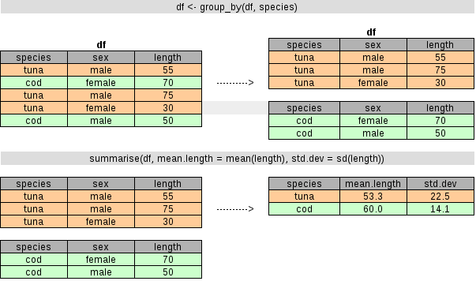

```{r, echo = FALSE}
knitr::opts_chunk$set(warning = FALSE,
                      message = FALSE)

knitr::opts_chunk$set(out.width='750px', dpi=200)
```

```{r, echo = FALSE}
#source("R/common.R")
```


# Preamble
____

```
NOTE TO READERS: The first version (until 27.1.2017) of this document used Sea Around Us (SAU) CRFM regional catch data. That version is now found in the link given below. The reason for switching was that the SAU data was a bit too much as a starter (275736 rows). And a bit limited in terms of what could be shown as computational statistics. The new data used to introduce the grammar of data is introduced below.
```
[Here](dplyr_old.html) is the older version of the document that used the SAU data. It and the comment above will be removed from this site within the next few weeks.

__Suggested reading material__: Chapter 5 on Data transformation in the [R for Data Science](http://r4ds.had.co.nz) book.

On the RStudio site there is also a nice [cheat sheet](https://www.rstudio.com/wp-content/uploads/2015/02/data-wrangling-cheatsheet.pdf)


## Needed libraries for this tutorial:
```{r, warning = FALSE, results='hide'}
library(tidyverse)
```

```{r, echo = FALSE}
library(png)
library(grid)
```

## The example data

The data we are going to use is the regional catch and effort flying fish data that was used as a part of the [UNU-FTP stock assessment course](http://fishvice.hafro.is/doku.php/crfm:start) that was held some years ago. It data contains observation of catch and effort by year, month, country and vessel type.

__Getting the example data into R__:

```{r}
ff <- read.csv("http://www.hafro.is/~einarhj/crfmr/data-raw/flyingfish.csv",
               stringsAsFactors = FALSE)
```

__Quick overview of the data__:

```{r}
glimpse(ff)
```

# Grammar of data

The tidyverse package, through the dplyr and tidyr, are a set of tools for a common set of problems connected to aggregates or summaries of data.

* Similar to ggplot2 they feature a Domain Specific Language (DSL) specially designed for data summaries.
* Developed by Hadley Wickam, the creator ggplot2 and other useful tools.

Commonly, when collating summaries by group, one wants to:

* **Split** up a big data structure into homogeneous pieces,
* **Apply** a function to each piece
* **Combine** all the results back together.


For example, one might want to

* quickly calculate summary statistics by species
* perform group-wise transformations like scaling or standardizing
* fit the same model to different ...

# dplyr

Essentially dplyr offers a collection of simple but powerful verbs (functions) that facilitate this split-apply-combined process:

* **filter**: keep rows matching criteria
* **select**: pick or drop columns by name
* **arrange**: order the rows according to a variable
* **mutate**: add new variables
* **summarise**: reduce variables to values
* **group_by**: gives the group to apply the analysis functions to 

The structure of these commands is always the same:

* First argument is a data frame
* Always return a data frame
* Subsequent arguments say what to do with data frame
* (Never modify in place)
* It recognizes the columns of the data.frame as variables, that is only need to call `col.name` instead of `dat$col.name`

## Select


```{r,width=150,echo=FALSE, eval = FALSE}
img <- readPNG("img/select.png")
grid.raster(img)
```

Select only certain columns 
```{r}
ff.redux <- 
  select(ff, Year, Month, Trips)
glimpse(ff.redux)
```

select all columns except __Country__ and __Weight..kg.__ (e.g. if we were only interested in analysing the effort in some potential following steps):
```{r}
ff.redux <- 
  select(ff, -Country, -Weight..kg.)
glimpse(ff.redux)
```

Select also allows you to rename columns:
```{r}
ff.redux <- 
  select(ff, catch = Weight..kg., effort = Trips)
glimpse(ff.redux)
```

but this also removes columns.

## Rename


Instead of changing variable name with select (as shown above) one can use `rename`. The difference is that all original data are left intact. Lets for sake of sanity do that here on the original data frame (i.e. we overwrite the `ff` dataframe):

```{r}
ff <- 
  rename(ff,
         month = Month,
         country = Country,
         vessel = Vessel,
         catch = Weight..kg.,
         effort = Trips)
glimpse(ff)
```

Noticed that I:

* Overwrote the orginal __ff__-dataframe.
* Changed all variables except __Year__. If you had used `select` instead of `rename` in the code above that column would have been dropped from the __ff__-dataframe.
* In three of the cases I only changed the first capital letter from upper to lower. The reason is that if one has a capital letters in variable names that means an extra key stroke (SHIFT) in any subsequent codeing. I.e. just trying to save some extra physical activity :-)
* Turned the variable name __Weight..kg.__ and __Trips__ into a more generic name:
    - Firstly because I, the analysist know that the catch is in kg and the effort is number of trips.
    - Secondly, and more importantly if I were to work later on a different data set, that would e.g. have variable names as __Weight..lbs.__ and  __Hours__ for catch and effort by renaming them to __catch__ and __effort__ I could use the code below with minimal changes.

Now what is left is of couse to change the variable name __Year__ to __year__ (would have already done it in the step above but then you would possibly have missed the point of what `rename` does):

```{r}
ff <- rename(ff, year = Year)
```

## Filter


One can create a subset of the data using the `filter` command:
```{r}
ff.barbados <-
  filter(ff,
         country == "Barbados")
glimpse(ff.barbados)
```

Notice here that __ff.barbados__ has only `r nrow(ff.barbados)` obsverations compared with the full dataset having `r nrow(ff)` observations.

One can filter further:
```{r}
ff.barbados.dayboats <-
  filter(ff,
       country %in% c("Barbados"),
       vessel == "Dayboats")
glimpse(ff.barbados.dayboats)
```

So now we are down to `r nrow(ff.barbados.dayboats)` observations (number of observations of Barbados dayboats).

Filter can use any logical statement:
```{r,eval=FALSE}
 a == b   ## a is equal to b
 a != b   ## a is not equal to b
 a > b    ## a is greater than b
 a >= b   ## a is greater or equal to b
 a < b    ## a is less than b
 a <= b   ## a is less or equal to b
 a & b    ## a and b
 a | b    ## a or b
 !a       ## not a
 is.na(a) ## is a equal to NA (missing)
 a %in% b ## elements of column a that are also in b 
```

For example (results not shown, try it out yourself):
```{r, eval = FALSE}
d1 <- filter(ff, year >= 2001)
glimpse(d1)
d2 <- filter(ff, year >= 2001, month == 12)
glimpse(d2)
d3 <- filter(ff, year >= 2001, month == 12, country == "StLucia")
glimpse(d3)
d4 <- filter(ff, year >= 2001, month == 12, country == "StLucia", effort < 25)
glimpse(d4)
d5 <- filter(ff, year >= 2001, month == 12, country == "StLucia", effort < 25, catch > 400)
glimpse(d5)
```

Notice that the in the last step (created object __d5__) we ended up with a dataframe that contains only one observation (row).

Further along this line we can e.g. exclude the Barbados obervation from the data. This can be done in three ways, all leading to the same results (not run, try it yourself):

```{r, eval = FALSE}
d1 <- filter(ff, country != "Barbados")
glimpse(d1)
d2 <- filter(ff, country %in% c("StLucia", "Tobago"))
glimpse(d2)
d3 <- filter(ff, country == "StLucia" | country == "Tobago")
glimpse(d3)
```

A related function is the `slice` function, that simply filters the data by row number. E.g. to filter the 1st, 4th, 5th, 6th and the 100th row one can do:
```{r}
ff.slice <- 
  slice(ff, c(1,4:6,100))
glimpse(ff.slice)
```

Not very useful on its own, but the power of the `slice` function will be shown later.

## Arrange


Arrange by catch (in ascending order):
```{r}
ff.arr <- arrange(ff, catch)
glimpse(ff.arr)
```

or in descending order:
```{r}
ff.darr <- arrange(ff, desc(catch))
glimpse(ff.darr)
```

You can also arrange by more that one column:
```{r}
ff.arr2 <- arrange(ff, desc(year), desc(catch))
glimpse(ff.arr2)
```

Which basically means that we have sorted the data such that the last year of observation (2008) comes first and then within any year the highest catch comes first. In the particular case fist record is for the year 2008, month is March (4), country is Barbados and the Vessel type is Iceboats. Not very interesting in itself (one could have achieved the same in Excel), but hold on - this simple function may become useful further down the line.

## Mutate


Mutate allows you to add new columns to your data. Let's e.g. calculate the value per kg
```{r}
ff.cpue <-
  mutate(ff,
         cpue = catch/effort)
```

You can also do more than one "mutation", e.g. here we convert kilograms to pund, and then use that variable to calculate cpue in units of pounds per trip.
```{r}
ff.cpue_lbs <-
  mutate(ff,
         catch_lbs = catch * 2.20462262,
         cpue_lbs =  catch_lbs/effort)
glimpse(ff.cpue_lbs)
```

## Summarise


```{r,width=150,echo=FALSE, eval = FALSE}
img <- readPNG("img/summarise.png")
grid.raster(img)
```

Useful to create (not so) simple summaries of the data
```{r}
ff.summ <- 
  summarise(ff, 
            catch  = sum(catch),
            effort = sum(effort))
glimpse(ff.summ)
```

Useful helper function
```{r,eval=FALSE}
n()             ## counts the number of rows
n_distinct(x)   ## counts the number distinct values of x
first(x)        ## first value of x
last(x)         ## last value of x
nth(x,n)        ## nth value of x  
```

For example, if we want to calculate the number of records, number of countries, months and years:

```{r}
ff.summ2 <- 
  summarise(ff,
            n = n(),
            ncountries = n_distinct(country),
            nmonths    = n_distinct(month),
            nyear      = n_distinct(year),
            year_first = min(year),
            year_last  = max(year))
ff.summ2
```


## Group_by



Summarize is somewhat useful on its own but become much more useful when combined with a `group_by` statements:

* **group_by** Group data into rows with the same value of (a) particular variable(s)
* **ungroup** Remove grouping information from data frame

```{r}
ff.group <- 
  group_by(ff, country)
ff.group
```

In the above code we have grouped the data by country (note the second line). If we now repeat the summary calculation we did above on the grouped dataframe (ff.group) we get the summary by each country:

```{r}
ff.summ3 <- 
  summarise(ff.group,
            n = n(),
            ncountries = n_distinct(country),
            nmonths    = n_distinct(month),
            nyear      = n_distinct(year),
            year_first = min(year),
            year_last  = max(year))
ff.summ3
```

We can use the `group_by` function on more than one column, e.g. by country and catch-class and then apply some summary statistics:
```{r}

ff.group2 <- 
  group_by(ff, country, vessel)
ff.summ4 <- 
  summarise(ff.group2,
            n = n(),
            ncountries = n_distinct(country),
            nmonths    = n_distinct(month),
            nyear      = n_distinct(year),
            year_first = min(year),
            year_last  = max(year))
ff.summ4
```

## Combining dplyr verbs

In R one can apply functions to data repeatedly:
```{r}
ff.summ <- 
  arrange(summarise(group_by(select(mutate(ff, cpue = catch/effort), country, vessel, cpue), country, vessel), n=n(), cpue = mean(cpue)), desc(cpue))
ff.summ
```

The problem here is that this is very hard to read because in order to understand what has been done one has to read the code from __inside out__. If we were to write this as a pseudo-code we could do something like this:

* calculate the cpue per trip
* select the columns country, vessel and cpue
* group the data by country and vessel
* provide summary statistic of the number of records and the mean cpue
* arrange it by the cpue in descending order (country and vessel with highest cpue first).


## The `%>%` operator

dplyr allows chaining of operations using the $\%>\%$ (pipe). By use of the pipe one can get the same as above by:

```{r}
ff %>% 
  mutate(cpue = catch/effort) %>% 
  select(country, vessel, cpue) %>% 
  group_by(country, vessel) %>% 
  summarise(n = n(),
            cpue = mean(cpue)) %>% 
  arrange(desc(cpue))
```

Now this is much more readable and almost equivalent to the pseudo-code we wrote above. 

What happens here is that instead of calling a function with `f(x,y)` you can do `x %>% f(y)`, that is "take x, then apply f with a setting y. This essentially means that `%>%` operator takes the stuff on the left and places it as the __first__ argument to function on the right hand side. 
If we take e.g. the first bit of code above:
```{r, eval = FALSE}
# not run
ff %>% 
  mutate(cpue = catch/effort)
```

It basically means that we pass the dataframe ff as the first argument in the `mutate` function.


