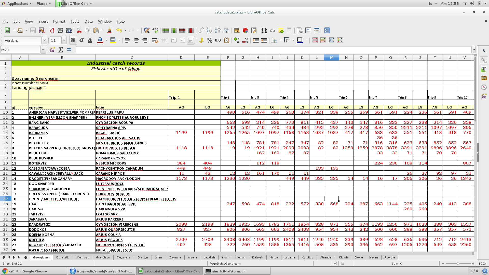

```{r setup, include=FALSE}
knitr::opts_chunk$set(echo = TRUE,
                      message = FALSE)
```

## Preamble
___

I suspect that those of you that are not storing your data in a database may use and have myriads of Excel sheets that contain the raw data or some aggregate thereof. Even those of you that do store the bulk of the data in a database may store additional data, that "do not fit the database structure" in Excel sheets. The current document provides some ideas (read: R code) on how one can read in consistently formatted data from Excel.

In [Importing data into R](importing.html) we introduced the `read_excel` function. As a default the function expect that the column header is in the first row. That is however not always the case. The first rows in the Excel sheet may often contain metadata, like boat name, boat registration id, landing harbor name. Or whatever else. And this may then be followed in rows further down below with the actual individual records.

In addition the individual records may be of a format that is not "tidy", in the sense that each row is not a record and each column is not a variable. This hampers any efficient analysis of the data.

There are two possible approaches:

* Restructure the Excel data sheet so that it is easy to read into R as well as being easy for further analysis
* Generate R-code that reads in the data and re-formats it so that it is suitable for further analysis.

The former is in many cases undesirable. If only because reconstructing meticulously laid out data in Excel into a computer likable form:

* Requires a lot of work
* May result in unintentional or unforeseen errors

So, attempting to generate an R-code, which basically leaves the current Excel structure intact may be a desirable root to take (consider that as a strength). The weakness is that if the original structure in the Excel is complicated the R-code to read in the data and tidying it may also be complicated.

Although the codes provided below are case specific there are generally only limited number of functions one needs to master to import consistently formatted excel sheets:

* `read_excel` which has e.g. the following arguments:
    - __path__: Directory path to the excel file
    - __sheet__: Sheet to read. Can be either a numerical value (the position of the sheet) or a string that contains the name of the sheet.
    - __skip__: The number of rows to skip before reading any data
    - __na__: Code for the missing value. By default blank values are considered missing. But in some cases other values are used (e.g. -999)
* `select`: Pick or drop columns by name
* `gather`: Gather columns into rows
* `separate`: Separate one column into many
* `spread`: Spread rows into columns

Needed libraries:
```{r}
library(tidyverse)
library(readxl)
```

## Case example 1

TODO: Case example 2 (below) is quite complicated as a starter. Need a more gentler case example #1

## Case example 2
___

In this example we have a single Excel files that contains a number of sheets. The data is a full year of landing statistics by boat and trips from one of the regional fleets. The Excel file is on [the web](http://www.hafro.is/~einarhj/crfmr/data-raw/catch_data2.xlsx). It can be downloaded by either clicking on the link or by using the `download.file`-function:
```{r, eval = FALSE}
download.file("http://www.hafro.is/~einarhj/crfmr/data-raw/catch_data2.xlsx",
              "data-raw/catch_data2.xlsx")
```

If one opens the file in Excel on observes that each sheet is of the same format:

* One sheet per boat, the sheet names being an abbreviation of the boat name.
* Within each sheet catch data are reported by trip and species
* Metadata, including boat name, boat registration number and landing place are stored within the top 6 rows.
* In each sheet the detailed column header is in row 9
* The trip number is however reported in row 7
* The first three columns contain a row identifier followed by English and Latin species name
* The first trip is recorded in the 4th and 5th column and so on. The number of recorded trips is variable among boats (sheets).
* The pair of two columns within a trip represent the catch of two landing categories. 

A screenshot of one sheet is as follows:


We take note here that species names are listed even though in some cases there are no catches within a particular boat-trip. This means that there are a lot of "empty records", because this "species layout" seems to standard for all the sheets. One may hence presume that there are not a lot of typing errors associated with species names in the Excel sheet - something that can be a nightmare to clean.

If one thinks about what are the "true" records (rows) in the data it basically boils down to two landing value (different categories) by species by boat and trip (we will ignore the harbor for now, see further below). So the variables (columns) we would like to end with are:

* id: This is just a numerical row identifier that most likely is also a numerical species identifier.
* species: English name for a species
* latin: Latin name for a species
* boat: name of boat
* trip: Numerical value for the trip
* ag: Amount landed in category "ag"
* lg: Amount landed in category "lg"

Lets assign the path and the file name:
```{r}
fil <- "data-raw/catch_data2.xlsx"  # you need to change the file path
```

We can obtain the name of the sheets (boats) by using the `excel_sheet` function:
```{r}
sheet.names <- excel_sheets(fil)
sheet.names
```

So here we have `r length(sheet.names)` number of sheets (each representing data from a single boat), the first being named `r sheet.names[1]`, the second `r sheet.names[2]` and so on.

Side point, try running this code
```{r, eval = FALSE}
sheet.names[1]
sheet.names[2]
sheet.names[3]
i <- 7
sheet.names[i]
```
Note that each line returns the name of the 1st, 2nd, 3rd and the ith sheet (here 7). We are going to use this feature further down the line.

### Reading in a single sheet

In the above we see that the name of the first sheet (boat) is "Georgieann". We can read in the data using the `read_excel` function. We skip the first 8 rows since the data column names actually start in row 9. Hence:
```{r}
d <- read_excel(fil, sheet = "Georgieann", skip = 8)
```
or alternatively:
```{r}
d <- read_excel(fil, sheet = 1, skip = 8)
```
or alternatively:
```{r}
d <- read_excel(fil, sheet = sheet.names[1], skip = 8)
```

Lest see what we have got:
```{r}
glimpse(d)
```
So this sheet has `r nrow(d)` rows of data (each row represents a species) and `r ncol(d)` columns. We note that the first three columns are as expected some kind of an id, species name and latin name. Following that are 34 pairs of column names "AG" and "LG" and then the last column is labelled Total (presumably row total). It is nice to observe that all these columns were interpreted as numeric (coded as "\\\<dbl\\\>" above). This means than no nasty characters other than numbers or even just some "spaces" were in the Excel sheet.

The next objective is to get the data into usable form. Here we need first to do 2 things:

* Get the trip numbers into the column name (recall that it was skipped, since it is stored in row 7 in the Excel sheet). Thankfully the trip numbers in this case are just sequential orders starting with trip number 1.
* For the purpose of any further analysis we need to convert the data from wide to long. We basically want to end with a dataframe where, just to repeat myself each row represents a record and each column is a variable.

The number of trips in the above data are the number of columns (`r ncol(d)`) minus the first three columns (id, species, latin) and the last column (total). And because each trip is represented by two columns (ag and lg) we must divide by 2. We thus have 36 trips in the first sheet. Turning this verbal description into and R code results in:
```{r}
n <- (ncol(d) - 4)/2
n
```

Now we want to rename the columns such that:

* First three columns names are "code", "species", "latin"
* For each trip we want to start with the variable name followed by the trip number (ag_1, lg_1, ag_2, lg_2, ag_3, ....). Here we need to use the `c`-, `paste` and the `rep` function as well as the information on the number of trips to generate a vector that contains the column names (TODO: This needs a little bit of an explaining - add document in the 1st section):
```{r}
cn <- c("code", "species", "latin",
        paste(rep(c("ag", "lg"), n), rep(1:n, each = 2), sep = "_"),
        "total")
cn
```

Now we simply use the __cn__-vector as names for the dataframe:
```{r}
names(d) <- cn
names(d)
```

The data is still in an untidy wide format. We use the `gather`-function to turn the data into a long format. We also take the opportunity to first drop the "total" column since it is supposedly a derived value (a row sum of catches) but add a column that contains the boat name:
```{r}
d <-
  d %>% 
  select(-total) %>% 
  mutate(boat = "Georgieann") %>% 
  gather(key = category, value = catch, -c(code, boat, species, latin))
glimpse(d)
```

We now have data that is "a little bit too long" (note that the number of records are `r nrow(d)`). This is because for each boat-trip-species combination we have two records (rows) instead of one. One of the pairs contains the catch metric for "ag" the other for the "lg". We also do not have catch type ("ag" and "lg") and boat trip as separate variables (columns). The step we take is:

* Use the `separate` function to split the column named "category" into columns "type" and "trip_no" using the "_" as a separator.
* Use the spread function to "reconstruct" the dataframe the such that the catch metrics are given as two columns based on the metric type ("ag" and "lg")

```{r}
d <-
  d %>% 
  separate(category, c("type", "trip_no"), sep = "_", convert = T) %>% 
  spread(type, catch)
```

Read the code in the spread function as "spread the catch according to type".

### Generating a function

Now since the data in the different sheets is suspected to be of the same structural format (with the exception that the number of trips is variable) we should be able to repeat the procedure. And since we are going to attempt this we may as well generate our own function that includes the essence of the script we generated above within a single object R object that is a function. We give the function a very generic name (`read_case_example2`) and add some (hopefully) useful comments/reminders to ourselves:

```{r}
read_case_example2 <- function(fil, sheet.no = 1) {
  
  # get the sheet (boat) names
  sheet.names <- excel_sheets(fil)
  
  # read in sheet as specified by the sheet.no
  d <- read_excel(fil, sheet = sheet.no, skip = 8) 
  
  # calculate the number of trips
  n <- (ncol(d) - 4)/2
  # set column names
  cn <- c("code", "species", "latin",
          paste(rep(c("ag", "lg"), n), rep(1:n, each = 2), sep = "_"),
          "total")
  names(d) <- cn
  
  d <-
    d %>% 
    # no need for the total column since it is a derived value
    select(-total) %>% 
    # drop rows that do not have species names
    filter(!is.na(species)) %>% 
    mutate(boat = sheet.names[sheet.no]) %>% 
    # make the data long
    gather(key = category, value = catch, -c(code, boat, species, latin)) %>% 
    separate(category, c("type", "trip_no"), sep = "_", convert = T) %>%
    # make a separate column for each catch type ("ag" and "lg")
    spread(type, catch) %>% 
    tbl_df()
  
  return(d)
}
```

Now to use this function and read in the second sheet:

```{r}
d <- read_case_example2(fil = fil, sheet.no = 2)
glimpse(d)
```

### Reading in multiple sheets

The next step is to read in all the sheet. Here we demonstrate it by using a for-loop (TODO: Need to add documentation on the basics in the introduction).

TODO: Add more explanation here

```{r}
res <- data_frame()  # generate a blank data frame
for (i in 1:length(sheet.names)) {
  
  # read in sheet number i
  x <- read_case_example2(fil, sheet.no = i)
  # aggregate the data
  res <- bind_rows(res, x)

}
# aggregate the data
d <- bind_rows(res)
```

Lets see what we got:
```{r}
glimpse(d)
```

We see that we got a column which has no names. Should really double check why, but for now we will just get rid of it. We will also get rid of rows that do not contain any catch records.
```{r}
d <-
  d %>% 
  select(code:lg) %>% 
  filter(!is.na(ag) | !is.na(lg))
```


Now the data are in a tidy format and hence ready for some analysis. Just a little example of what now can be done - here calculate the catch of each species and display the top 10 species with the highest catch:
```{r}
d %>% 
  mutate(catch = ag + lg) %>% # this may be wrong
  filter(!is.na(species)) %>% 
  group_by(species) %>% 
  summarise(catch = sum(catch, na.rm = TRUE)) %>% 
  arrange(desc(catch)) %>% 
  slice(1:10)
```

### Reading in metadata

The `read_excel` function in the __readxl__-package takes very limited arguments. E.g. we can not specify to read only a certain region from an Excel sheet. There are other packages that contain functions that allow one more control on what to read in.

E.g. we may want to read in the meta-data (header) information (boat name, boat id and harbor id) that resides in region "A4:A6" in each sheet. Here we can use the `readWorksheetFromFile`-function that resides in the __XLConnect__ package (you may need to install the package).

```{r}
library(XLConnect)
```

Firstly, we could have used the function to read in the actual data, giving the same dataframe as was done above, albeit with slightly different column names:
```{r}
d <- readWorksheetFromFile(fil,
                           sheet=1,
                           startRow = 9)
```

But we are interested in reading in the metadata. Here we can do:

```{r}
meta <- readWorksheetFromFile(fil,
                                  sheet=1,
                                  region = "A4:A6",
                                  header = FALSE)
meta
```

Since no column header was read in we are given a default column header "Col1". We can use the `separate` function to split the data into two columns:
```{r}
meta <-
  meta %>% 
  separate(Col1, c("variable", "value"), sep = ": ")
```

We turn the "value" column into a vector (lets overwrite the meta object):
```{r}
meta <- meta$value
```
and take note that the 1st element contains the boat name, the second the boat id and the third the harbor id. You can try for yourself by:
```{r}
meta[1]
meta[2]
meta[3]
```

We would like to include these metadata in our dataframe. The most efficient way is to amend the functions we created earlier:
```{r}
read_case_example2 <- function(fil, sheet.no = 1) {
  
  # ammendments: get the metadata
  meta <- 
    readWorksheetFromFile(fil,
                          sheet = sheet.no,
                          region = "A4:A6",
                          header = FALSE) %>% 
    separate(Col1, c("variable", "value"), sep = ": ")
  meta <- meta$value
  
  # get the sheet (boat) names
  #  we dont need this anymore because the boat name is in the meta-object
  # sheet.names <- excel_sheets(fil)
  
  # read in sheet as specified by the sheet.no
  d <- read_excel(fil, sheet = sheet.no, skip = 8) 
  
  # calculate the number of trips
  n <- (ncol(d) - 4)/2
  # set column names
  cn <- c("code", "species", "latin",
          paste(rep(c("ag", "lg"), n), rep(1:n, each = 2), sep = "_"),
          "total")
  names(d) <- cn
  
  d <-
    d %>% 
    # no need for the total column since it is a derived value
    select(-total) %>% 
    # drop rows that do not have species names
    filter(!is.na(species)) %>%
    # ammendments: include the metadata
    mutate(boat = meta[1],
           harbour = meta[3]) %>% 
    # make the data long
    gather(key = category, value = catch, -c(code, boat, harbour, species, latin)) %>% 
    # get rid of "empty records"
    separate(category, c("type", "trip_no"), sep = "_", convert = T) %>%
    # make a separate column for each catch type ("ag" and "lg")
    spread(type, catch) %>% 
    tbl_df()
  
  return(d)
  
}
```

Lets see if the amended function works:
```{r}
d <- read_case_example2(fil, 1)
glimpse(d)
```

Ergo: We have now one added column containing the harbor id.

We can now try to re-read in all the data with the for-loop:
```{r}
res <- data_frame()  # generate a blank data frame
for (i in 1:length(sheet.names)) {
  
  # read in sheet number i
  x <- read_case_example2(fil, sheet.no = i)
  # aggregate the data
  res <- bind_rows(res, x)

}
# aggregate the data
d <- 
  bind_rows(res) %>% 
  select(code:lg) %>% 
  filter(!is.na(ag) | !is.na(lg))
```

### Recapitulation of case 2

The above seems like a lot of steps to take. But once we have set up the code correctly we can apply it to more Excel sheets that have the same structure. If we save the function in an R-script ("read_case_example2.R") under e.g. the R-directory we effectively really end with the following code:
```{r, eval = FALSE}
library(tidyverse)
library(readxl)
library(XLConnect)

source("R/read_case_example2.R")  # TODO: Need to clarify this in the basic documents
fil <- "data-raw/catch_data1.xlsx"
sheet.names <- excel_sheets(fil)
res <- data_frame()
for (i in 1:length(sheet.names)) {
  x <- read_case_example2(fil, sheet.no = i)
  res <- bind_rows(res, x)
}
d <- 
  bind_rows(res) %>% 
  select(code:lg) %>% 
  filter(!is.na(ag) | !is.na(lg))
```
